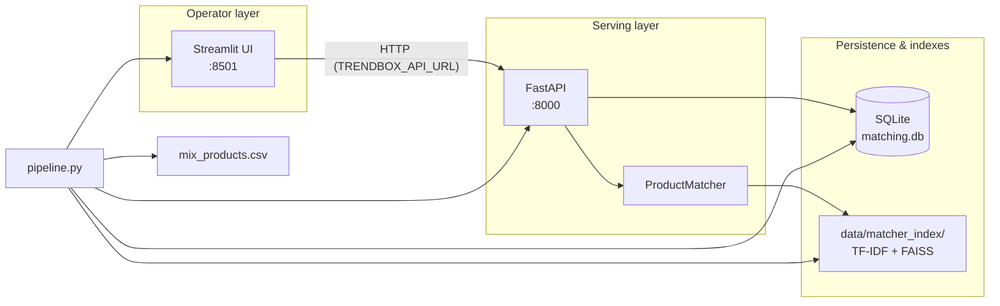
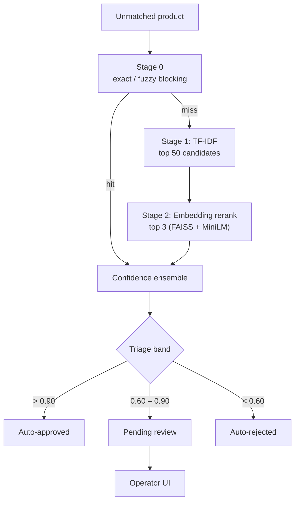
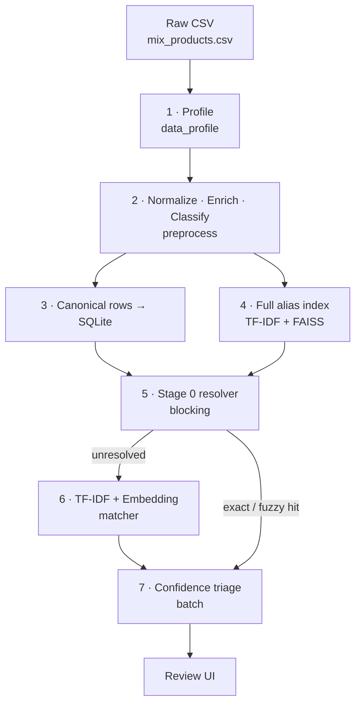
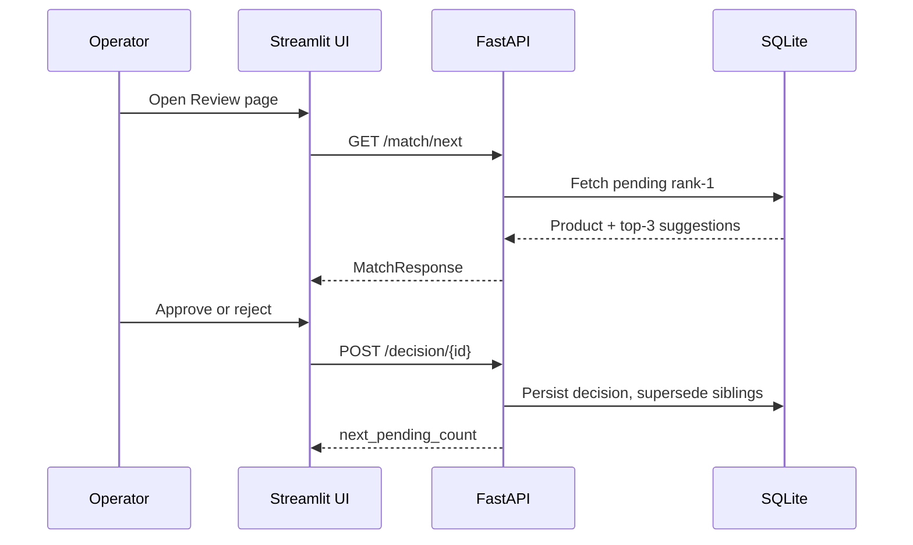

# Trendbox Product Matching

**Production-style catalogue linking for Turkish retail SKUs.** Unmatched product names are resolved against a barcoded reference index through a cascaded matcher (Stage 0 → TF-IDF → embeddings), confidence-based triage, and a Streamlit operator workflow.

Built for a mixed catalogue of **100,585 rows** where duplicate spellings, missing barcodes, and embedding near-duplicates make naive fuzzy matching unsafe at scale.


---

## Table of contents

- [Overview](#overview)
- [Architecture](#architecture)
  - [Runtime system](#runtime-system)
  - [Matching cascade](#matching-cascade)
  - [Data pipeline (offline)](#data-pipeline-offline)
  - [Human review loop](#human-review-loop)
- [Design decisions](#design-decisions)
- [Results](#results)
- [Quick start](#quick-start)
- [Operations](#operations)
- [API](#api)
- [Project layout](#project-layout)
- [Testing & CI](#testing--ci)
- [Configuration](#configuration)
- [Match Quality](#match-quality)
- [Documentation](#documentation)
- [License](#license)

---

## Overview

Trendbox receives product data from multiple sources. Some rows have complete barcodes; others do not. The same SKU often appears under different spellings (`Nutella 400gr` vs `Nutella Fındık Kreması 400 g`). Manual matching does not scale.

This system:

- **Profiles** catalogue quality before matching (duplicates, collisions, enrichment gaps)
- **Resolves** unmatched names via a cascaded pipeline — deterministic blocking first, ML for the long tail
- **Triages** each product into auto-approve, review queue, or auto-reject from rank-1 confidence
- **Surfaces** uncertain matches to operators with ranked suggestions and explanations
- **Persists** all decisions to SQLite and exposes live analytics

| Catalogue metric | Value |
|------------------|------:|
| Total rows | 100,585 |
| Barcoded reference rows | 58,434 |
| Unmatched (to link) | 42,151 |
| Barcodes with multiple spellings | 9,132 |
| Exact name overlap (unmatched ↔ barcoded) | 2,773 |

---

## Architecture

### Runtime system



`pipeline.py` is the single bootstrap entry point: load data → build or restore indexes → batch match → start API → launch UI.

### Matching cascade



### Data pipeline (offline)

End-to-end ingestion and index build before serving. Detail: [`docs/DATA_PIPELINE.md`](docs/DATA_PIPELINE.md).



### Human review loop

Medium-confidence products enter the operator queue; one decision resolves the whole product (sibling suggestions are superseded).



### Layer responsibilities

| Layer | Responsibility | Key modules |
|-------|----------------|-------------|
| **Ingestion** | Turkish normalisation, brand/weight extraction, product-kind classification, catalogue profiling | `preprocess.py`, `data_profile.py`, `reference_catalog.py` |
| **Resolution** | Stage 0 blocking, two-stage ML matcher, product-level batch triage | `blocking.py`, `matcher.py`, `batch.py`, `confidence.py` |
| **Indexes** | TF-IDF fit/cache, FAISS embedding index, unified snapshot dir | `index_builder.py`, `tfidf_retriever.py`, `embedding_reranker.py` |
| **Persistence** | ORM models, match/decision storage, analytics queries | `src/db/`, `database.py` (facade) |
| **API** | REST contract for UI and automation | `api/main.py`, `api/schemas.py` |
| **UI** | Review queue, analytics dashboards, pipeline health | `ui/app.py`, `ui/pages/` |
| **Config** | Paths, ports, env overrides | `src/config.py` |

### Scoring model

Ranked suggestions use an ensemble score; triage is decided from **rank-1 only** (one product → one outcome):

```
confidence = 0.40×TF-IDF + 0.40×embedding + 0.20×fuzzy
           + brand/weight match bonus (+0.05 each)
           − brand mismatch penalty (−0.20)
           − weight mismatch penalty (−0.15)
```

**Triage rules** (applied in order before standard thresholds):

1. Exact normalized name match → `auto_approve`
2. Brand match + confidence 0.45–0.60 → `review` (not auto-reject)
3. Standard: > 0.90 approve · 0.60–0.90 review · < 0.60 reject

Fresh produce (`product_kind = fresh`) skips false brand-mismatch penalties. Thresholds are justified by held-out evaluation — see [Results](#results).

### Matcher index cache

All retrieval artifacts live in one directory (default `data/matcher_index/`):

| File | Purpose |
|------|---------|
| `tfidf.joblib` | Stage 1 character TF-IDF index |
| `embedding_index.faiss` | Stage 2 FAISS vector index |
| `embedding_index_meta.joblib` | FAISS row metadata |
| `reference_embeddings.npy` | Cached reference embeddings |

`pipeline.py` builds here; FastAPI loads from here on startup.

---

## Design decisions

1. **Cascaded resolver, not ML-only.** ~2,773 unmatched rows share an exact normalised name with a barcoded row; Stage 0 resolves thousands deterministically before any model call.

2. **Two-stage retrieve-then-rerank.** Embedding-only search over 58k references is slow and recall@1 underperforms TF-IDF on spelling variants (0.55 vs 0.69 on held-out queries). TF-IDF retrieves 50 candidates in milliseconds; embeddings rerank the shortlist.

3. **Full alias index, canonical DB.** All 58,434 barcoded spellings are indexed for search; SQLite stores one canonical row per barcode. Dropping duplicate barcodes on load would discard 23k+ useful retrieval aliases.

4. **Product-level triage.** Status is set from rank-1 confidence only. Alternatives are stored as `alternative` (pending) or `superseded` (auto-resolved) — a product is never simultaneously approved and pending.

5. **Human-in-the-loop for the medium band.** Auto-approve/reject handles ~75% of volume; operators focus on ambiguous matches where embeddings and TF-IDF disagree.

6. **Single cache directory.** One `data/matcher_index/` tree avoids drift between build-time and API load paths.

---

## Results

Metrics from `scripts/evaluate.py` (held-out same-barcode alternate spellings) and a full batch run on the catalogue. Regenerate with the commands in [Operations](#operations).

### Retrieval quality (500 held-out queries)

| Approach | Recall@1 | Recall@3 |
|----------|---------:|---------:|
| TF-IDF only | ~0.60 | ~0.79 |
| **Two-stage (production)** | **0.608** | **0.792** |

### Batch triage (full unmatched set)

| Outcome | Count |
|---------|------:|
| Stage 0 resolved | 3,441 |
| Auto-approved | 8,350 |
| Pending review | 12,001 |
| Auto-rejected | 18,173 |
| Avg confidence | 0.639 |

---

## Quick start

**Requires Python 3.10+** and ~2 GB disk for the embedding model (first run downloads `paraphrase-multilingual-MiniLM-L12-v2`).

```bash
git clone https://github.com/Nabilhassan12345/trendbox-product-matching.git
cd trendbox-product-matching
pip install -r requirements.txt
pip install -e ".[dev]"
python pipeline.py
```

| Service | URL |
|---------|-----|
| Operator UI | http://localhost:8501 |
| API docs (Swagger) | http://localhost:8000/docs |
| Health check | http://localhost:8000/health |

First run: loads `data/mix_products.csv`, builds or restores indexes, batch-matches all unmatched products, starts API and UI. Subsequent runs reuse cached indexes and DB unless you pass `--rebuild`.

---

## Operations

| Goal | Command |
|------|---------|
| Full system (default) | `python pipeline.py` |
| Start app without re-matching | `python pipeline.py --skip-batch` |
| Force index rebuild | `python pipeline.py --rebuild` |
| Batch match only (no API/UI) | `python scripts/run_batch.py` |
| Catalogue quality report | `python scripts/profile_data.py` |
| Size quality audit (DB) | `python3 scripts/audit_size_quality.py` |
| Recall@k + threshold sweep | `python scripts/evaluate.py --max-queries 1000` |
| API only | `uvicorn api.main:app --port 8000` |
| UI only | `streamlit run ui/app.py` |

Copy `.env.example` → `.env` to override paths and ports. After changing reference data or blocking rules, run `python pipeline.py --rebuild`.

---

## API

| Method | Path | Purpose |
|--------|------|---------|
| `GET` | `/health` | Service status and queue depth |
| `GET` | `/stats` | Aggregate matching statistics |
| `GET` | `/analytics` | Full dashboard payload |
| `GET` | `/catalog/profile` | Catalogue quality JSON + live stats |
| `GET` | `/match/next` | Next product in review queue |
| `POST` | `/decision/{match_id}` | Operator approve / reject |
| `POST` | `/matches/{match_id}/reopen` | Re-queue auto-rejected match |
| `GET` | `/matches/recent` | Recent resolved matches by outcome |
| `POST` | `/batch_process` | Run matching for all unmatched products |
| `GET` | `/quality/summary` | Rank-1 size-verdict aggregates |
| `GET` | `/quality/matches` | Paginated matches by size verdict |
| `POST` | `/quality/matches/{id}/resolve` | Reject or reopen a quality conflict |

Interactive schema: http://localhost:8000/docs

---

## Project layout

```
pipeline.py                 # Bootstrap: load → index → batch → API → UI
src/
  config.py                 # Paths, ports, env overrides
  db/                       # models · session · catalog · matches · analytics
  index_builder.py          # TF-IDF / FAISS build + cache
  blocking.py               # Stage 0 exact/fuzzy resolver
  matcher.py                # Two-stage orchestration
  batch.py                  # Product-level triage (shared by pipeline + API)
  confidence.py             # Ensemble scoring + triage bands
api/                        # FastAPI + Pydantic schemas
ui/
  app.py                    # Streamlit home
  pages/                    # Review · Analytics · Pipeline
  utils/                    # theme · layout · components · charts
scripts/                    # evaluate · profile_data · run_batch · audit_size_quality
tests/                      # pytest suites + run_all_tests.py
docs/                       # DATA_PIPELINE.md · CALISMA_RAPORU.md
data/
  mix_products.csv          # Source catalogue (pipe-separated)
  matcher_index/            # Generated indexes (gitignored)
  matching.db               # Generated SQLite (gitignored)
  reports/                  # catalog_profile.json · evaluation_summary.json
```

---

## Testing & CI

```bash
pytest tests/                    # unit + API integration (17 tests)
python tests/run_all_tests.py    # file checks + imports + data smoke + pytest
```

GitHub Actions runs `run_all_tests.py` on every push and pull request to `main` (see `.github/workflows/ci.yml`).

---

## Configuration

All variables are optional. Copy `.env.example` to `.env`:

| Variable | Default | Purpose |
|----------|---------|---------|
| `TRENDBOX_DATA_CSV` | `data/mix_products.csv` | Source catalogue CSV |
| `TRENDBOX_DB_PATH` | `data/matching.db` | SQLite database path |
| `TRENDBOX_MATCHER_INDEX` | `data/matcher_index` | Matcher index directory |
| `TRENDBOX_CATALOG_PROFILE` | `data/reports/catalog_profile.json` | Catalog quality report |
| `TRENDBOX_API_URL` | `http://localhost:8000` | API base URL for the UI |
| `TRENDBOX_API_PORT` | `8000` | API port (`pipeline.py`) |
| `TRENDBOX_UI_PORT` | `8501` | Streamlit port (`pipeline.py`) |
| `TRENDBOX_SIZE_CONFLICT_POLICY` | `review` | Pack-size conflict triage: `review` or `reject` |

---

## Match Quality

Rank-1 matches are scored for **pack-size consistency** between the unmatched product and the top suggestion. Extracted weights (`150 g`, `kg`, `adet`, …) drive three verdicts:

| Verdict | Meaning |
|---------|---------|
| `size_verified` | Both sides have a pack size and they match |
| `size_conflict` | Both sides have a pack size and they differ |
| `size_unknown` | Weight missing on one or both sides |

**Guardrails (Phase 1+):** `size_conflict` never receives `auto_approve`. Triage follows `TRENDBOX_SIZE_CONFLICT_POLICY`:

- `review` (default) — conflict goes to the operator queue
- `reject` — conflict is `auto_rejected`

**Retrieval hardening:** When the query pack size is known, Stage 1 TF-IDF and the embedding rerank pool **exclude definite weight mismatches** (unknown candidate weights are kept for recall).

**Operator surfaces:**

- **Review** — amber banner on `size_conflict`, green caption on `size_verified`
- **Quality** (`ui/pages/04_Quality.py`) — KPIs, conflict list, reject/reopen actions
- **Home** — catalog integrity % and conflict count from `/quality/summary`

**Audit CLI** (read-only):

```bash
python3 scripts/audit_size_quality.py
python3 scripts/audit_size_quality.py --csv data/reports/size_conflicts_auto_approved.csv
```

Expect **zero** rank-1 rows with `size_conflict` + `auto_approved` after guardrails are active.

---

## Documentation

| Document | Description |
|----------|-------------|
| [`docs/DATA_PIPELINE.md`](docs/DATA_PIPELINE.md) | Ingestion cascade, alias index design, catalogue profile metrics |
| [`docs/CALISMA_RAPORU.md`](docs/CALISMA_RAPORU.md) | Turkish project report (problem, approach, results) |
| [`notebooks/`](notebooks/) | Exploration and experiment notebooks |

---

## License

Released under the [MIT License](LICENSE).
