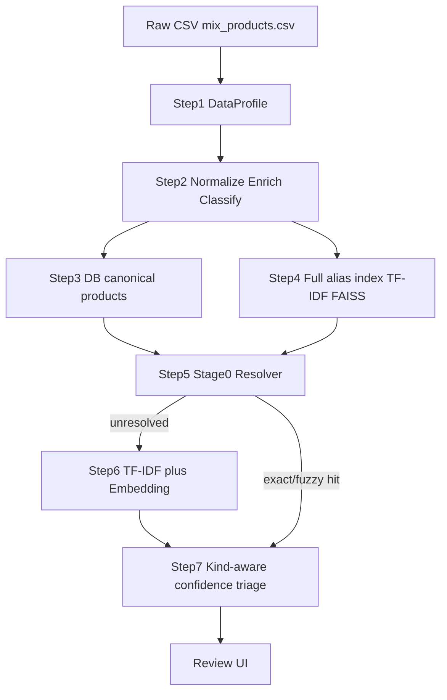

# Trendbox Data Pipeline

Architecture for ingesting, profiling, and preparing the mixed barcode catalogue
before the two-stage matcher runs.

## Overview



## Catalogue profile (mix_products.csv)

Run `python scripts/profile_data.py` to regenerate `data/reports/catalog_profile.json`.

| Metric | Value |
|--------|------:|
| Total rows | 100,585 |
| Barcoded | 58,434 |
| Unmatched | 42,151 |
| Duplicate barcode rows | 33,944 |
| Barcodes with multiple spellings | 9,132 |
| `name_clean` → multiple barcodes | 1,331 |
| Exact unmatched/barcoded name overlap | 2,773 |
| Unmatched missing weight | 44.9% |
| Rows lost to dedupe (old approach) | 27,264 |

**Key insight:** the CSV already contains thousands of alternate spellings per barcode.
Dropping duplicate barcodes on load discarded useful retrieval signal.

## Layer split

| Layer | Rows | Purpose |
|-------|------|---------|
| SQLite `products` | 73,321 canonical | One product per barcode; FK for matches |
| Matcher index | 58,434 alias rows | Every ERP spelling searchable |
| Stage 0 lookup | 50,431 name keys | Deterministic pre-ML resolver |

Implementation: [`src/reference_catalog.py`](../src/reference_catalog.py)

## Stage 0 — deterministic resolver

Before TF-IDF or embeddings, [`src/blocking.py`](../src/blocking.py) tries:

| Rule | Confidence | Triage |
|------|------------|--------|
| Exact `name_clean` → 1 barcode | 1.0 | Auto-approve |
| Exact → multiple barcodes | 0.85 | Pending (ambiguous) |
| Fuzzy spelling variant → 1 barcode | 0.92 | Auto-approve |
| Fuzzy → multiple barcodes | 0.85 | Pending |
| No hit | — | Fall through to ML |

Fuzzy matching uses token-level Turkish spelling tolerance (e.g. `maydonoz` / `maydanoz`).

## Product kind — kind-aware confidence

[`classify_product_kind()`](../src/preprocess.py) labels rows as `branded`, `fresh`, or `unknown`.

Fresh produce (e.g. names ending in `adet`, `demet`, `paket` without pack weight) skips
harsh brand-mismatch penalties and allows one-character brand token differences.

## Normalization

[`src/preprocess.py`](../src/preprocess.py):

- Turkish character folding (ı→i, ş→s, …)
- Unit standardisation (`400gr` → `400 g`)
- Brand and weight extraction from name tokens
- `product_kind` enrichment column

## Re-run after pipeline changes

Rebuild indexes when the reference alias set changes:

```bash
python pipeline.py --rebuild
```

Or batch only (after indexes exist):

```bash
python scripts/run_batch.py
```

## File map

| File | Role |
|------|------|
| `scripts/profile_data.py` | Data quality report CLI |
| `src/data_profile.py` | Profile metrics |
| `src/reference_catalog.py` | Canonical vs alias split |
| `src/blocking.py` | Stage 0 resolver |
| `src/preprocess.py` | Normalise, enrich, classify |
| `src/confidence.py` | Kind-aware ensemble scoring |
